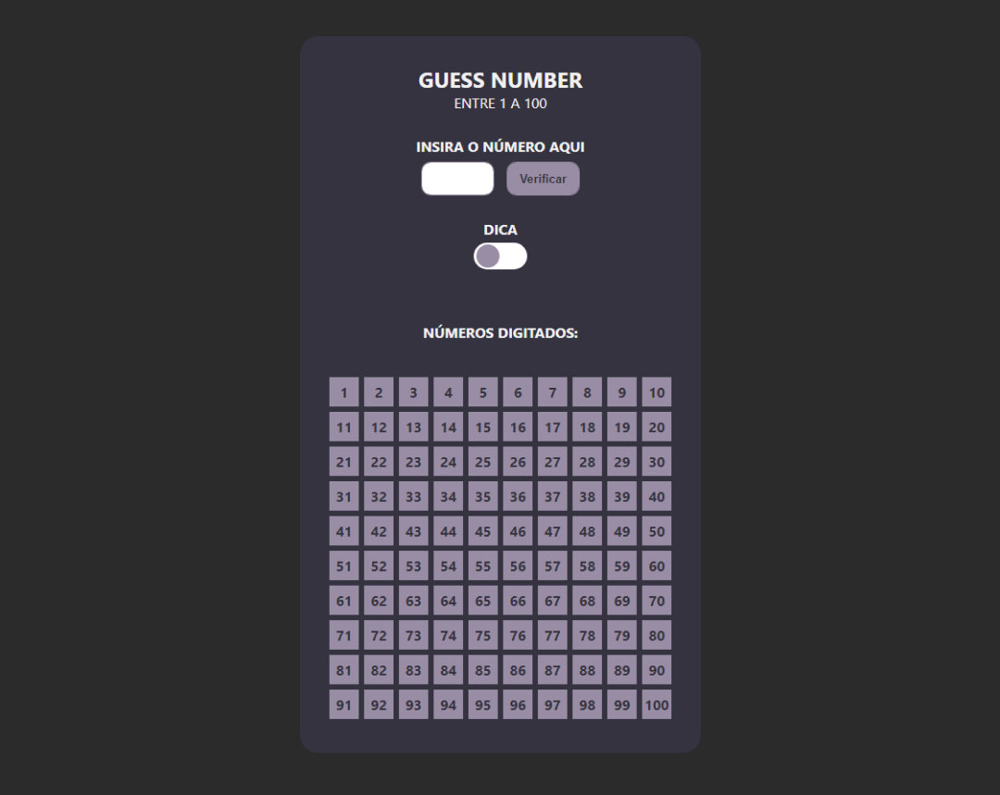
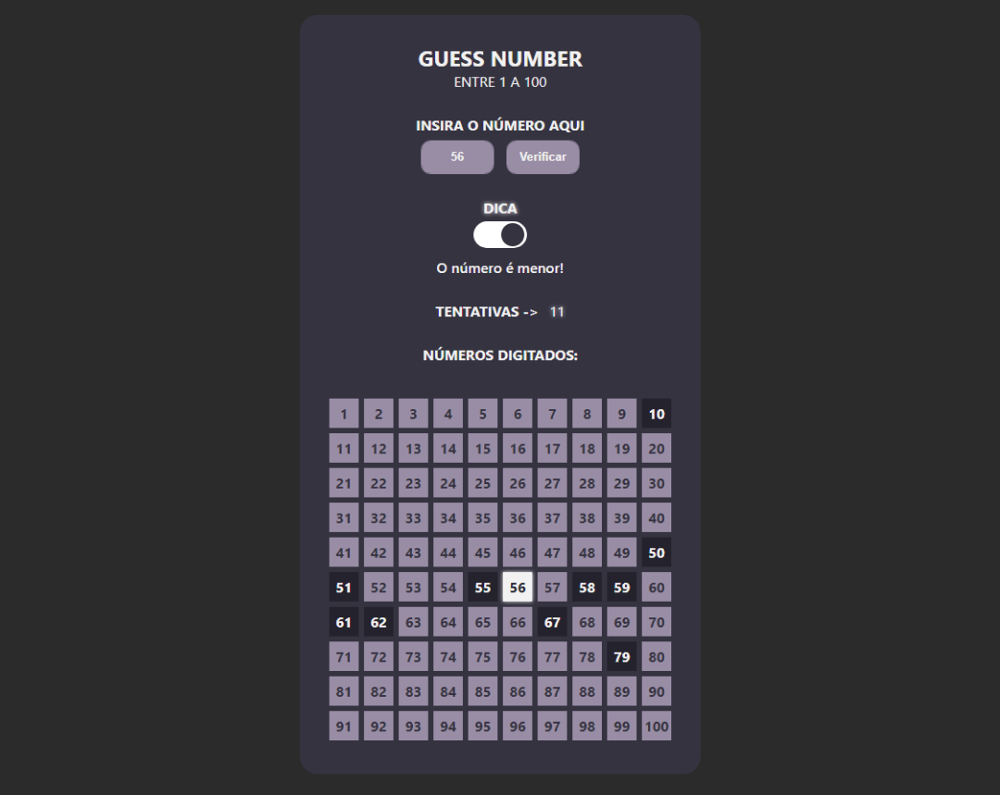
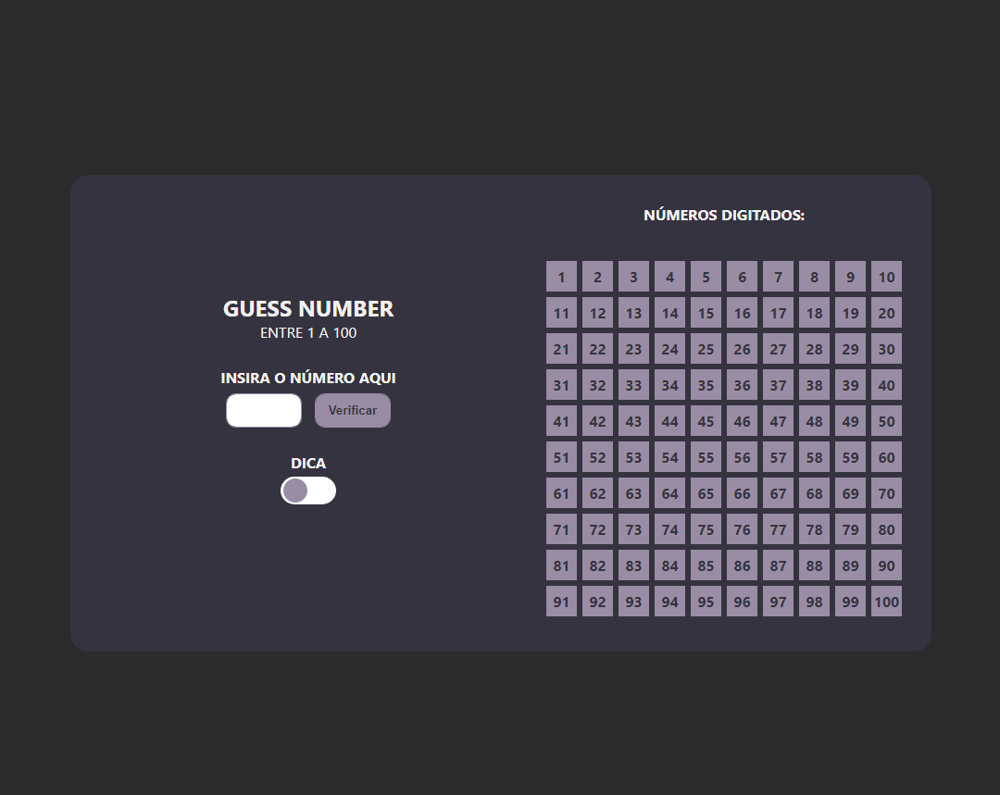
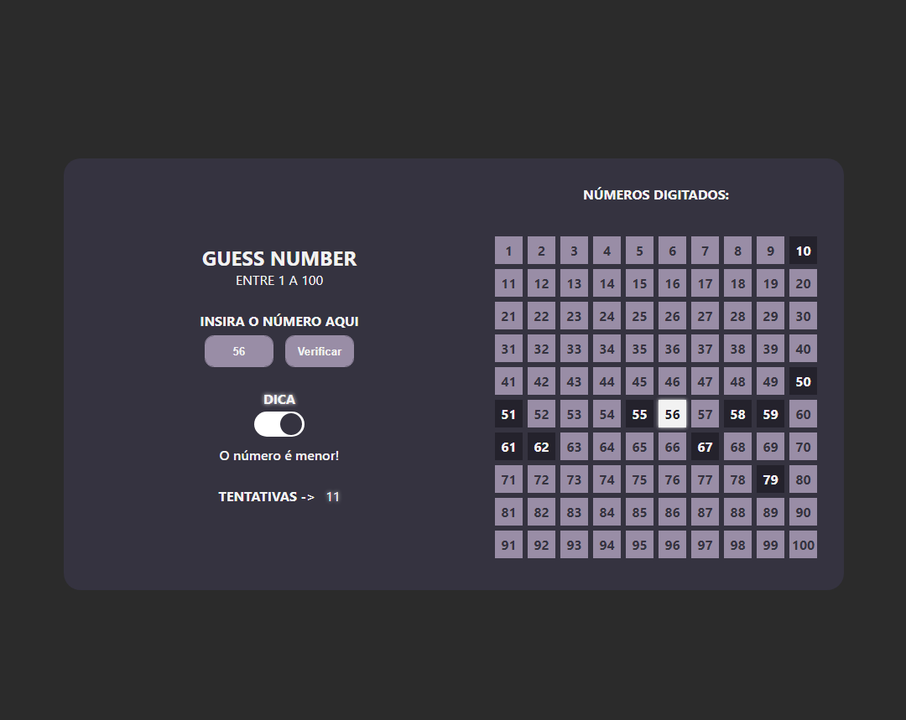

# Guess Number Game - Vai dar namoro Edition

### Project

Play <strong>-></strong> <a href="https://brunotznr.github.io/guessNumber-game/" target="_blank"><strong>Guess Number Game - Vai dar namoro EDITION</strong></a>

### Technologies

HTML5, CSS3 e Vanilla Javascript.

### Conception

Queria algum projeto onde pudesse me desafiar, vi em minha pasta um protótipo que tentei fazer a um tempo atras, 
voltei com ele, mas com uma ideia de, digamos assim, deixar as coisas mais divertidas.

Guess Number Game - Vai dar namoro Edition, tem a proposta de um jogo de adivinhação, 
onde é gerado uma número aleatório de 1 a 100, onde quando você acerta é emitido um efeito sonoro do 
programa ”Vai dar namoro!” do Rodrigo Faro, que faz quase sempre quando estou testando tomo um susto.

### Design

<figure style="display: flex;">
  
  
  
  
</figure>

### EM CONSTRUÇÃO...
